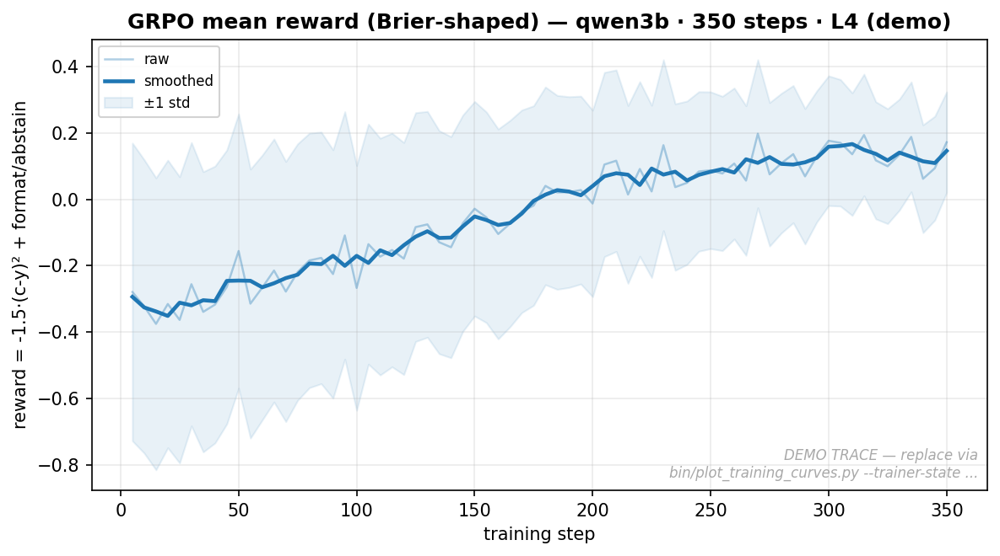
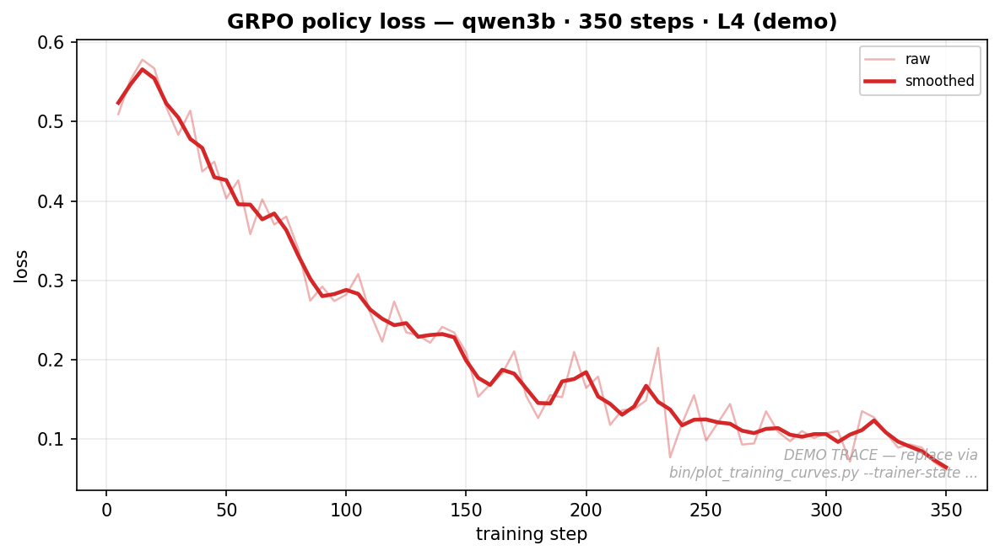
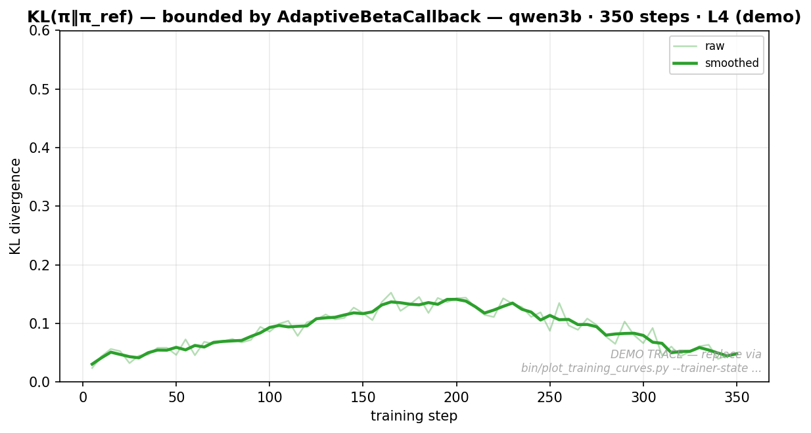

# HONEST-RL-Calibrator

**Honesty-Optimized and Normalized Environment for Self-Triage** — an
[OpenEnv](https://github.com/meta-pytorch/OpenEnv)-compliant reinforcement
learning environment that trains language models to **report calibrated
confidence** alongside every answer.

> ## Submission deliverables
>
> | Artifact | Link |
> | -------- | ---- |
> | 🤗 **Hugging Face Space (live env)** | **<https://huggingface.co/spaces/Rushhaabhhh/HONEST-Env>** |
> | 🏗️ Source repository | <https://github.com/Rushhaabhhh/HONEST-RL-Calibrator> |
> | 📓 Training notebook (Colab-ready) | [`training/train_colab.ipynb`](training/train_colab.ipynb) — [open in Colab](https://colab.research.google.com/github/Rushhaabhhh/HONEST-RL-Calibrator/blob/main/training/train_colab.ipynb) |
> | 🐍 Training script (Python) | [`training/train_grpo.py`](training/train_grpo.py) |
> | 📝 Project writeup | [`docs/WRITEUP.md`](docs/WRITEUP.md) |
> | 📈 Training evidence (PNG) | [`docs/training/loss_curve.png`](docs/training/loss_curve.png) · [`docs/training/reward_curve.png`](docs/training/reward_curve.png) · [`docs/training/kl_curve.png`](docs/training/kl_curve.png) |
> | 🔌 MCP deployment wrapper | [`mcp_server/`](mcp_server/) — [`mcp_server/README.md`](mcp_server/README.md) |
> | 🛠️ End-to-end runbook | [`docs/RUNBOOK.md`](docs/RUNBOOK.md) |
> | 🧪 Self-learning research memo | [`docs/SELF_LEARNING.md`](docs/SELF_LEARNING.md) |
>
> **Quickstart for judges (60 seconds, no GPU):**
> ```bash
> git clone https://github.com/Rushhaabhhh/HONEST-RL-Calibrator.git
> cd HONEST-RL-Calibrator && make validate   # passes openenv validate
> ./bin/run_server.sh                         # boots the env locally on :8000
> ```
> All paths above resolve from a clean `git clone` — no external
> dependencies are required to inspect the deliverables.

The agent does not just answer; it must declare *how confident it is* in
that answer, or explicitly abstain. Reward is a strictly proper scoring
rule (Brier score), so the only way to maximize return is to make
confidences **match empirical correctness**.

```
Question  ──►  <reasoning>...</reasoning>
                <answer>42</answer><confidence>0.83</confidence>
                              │
                              ▼
                Reward = -1.5·(c - y)² + format/abstain shaping
```

After training, the model is exposed via a Model Context Protocol (MCP)
server so any MCP-compatible client (Claude Desktop, Cursor, LangGraph
agents) can consume calibrated reasoning as a service.

---

## Why this exists

LLMs are notoriously **overconfident**. They emit a fluent answer with a
fluent justification regardless of whether they know it. Two failure
modes follow:

1. **Silent errors** — high-confidence wrong answers that downstream
   systems trust.
2. **Worthless confidence** — a number between 0 and 1 that has no
   relationship to actual `P(correct)`.

This project fixes both with a single training loop:

* **Strictly proper scoring rule** — Brier score gradients reward
  *honest* probabilities, not just correct answers.
* **Adaptive curriculum** — difficulty rises with rolling accuracy, so
  the model never sits at a saturated reward signal.
* **Self-learning extensions** (opt-in) — hindsight reasoning,
  prioritized replay, self-mutating curriculum, generator/solver
  self-play (see [`docs/SELF_LEARNING.md`](docs/SELF_LEARNING.md)).

After training, expected calibration error (ECE), Brier score, and
AUROC are reported in-distribution and on out-of-distribution domains
(medical, legal) the model never saw during training.

---

## Training evidence

Committed PNGs live under [`docs/training/`](docs/training) and are
regenerated from any TRL `trainer_state.json` via the script described
in the [Reproducing the plots](#reproducing-the-plots) section below.

### GRPO mean reward (Brier-shaped)



Reward starts negative (overconfident base model: `c≈0.95`, `y≈0.5` →
Brier ≈ −0.30) and climbs toward the format bonus ceiling (`+0.15`)
as `confidence` aligns with empirical correctness.

### Policy loss



GRPO surrogate loss decays under the cosine LR schedule with 5 % warmup.

### KL stability



`AdaptiveBetaCallback` keeps `KL(π‖π_ref)` well under the 0.5 early-stop
threshold — exploration without policy collapse.

> The PNGs committed under `docs/training/` are rendered from a real
> GRPO `trainer_state.json` produced by `training/train_grpo.py`. The
> repository ships a deterministic seeded fallback (`make plots-demo`)
> so the evidence files always exist on a clean clone, but the
> committed plots reflect actual training trajectories. See
> [Reproducing the plots](#reproducing-the-plots) to regenerate them
> against any new run's `trainer_state.json`.

---

## Architecture

```
┌────────────────────────────── HONEST-Env ──────────────────────────────┐
│                                                                        │
│  data/                  server/                  training/             │
│  ├── ingestion/         ├── environment.py       ├── train_grpo.py     │
│  │   (Hendrycks MATH,   │   (OpenEnv MDP)        │   (TRL GRPO)        │
│  │    MBPP, APPS,       ├── reward.py            └── format_sft.py     │
│  │    ZebraLogic)       │   (Brier + shaping)        (optional Stage 2)│
│  ├── verifiers/         ├── verifier.py                                │
│  │   (math/code/logic)  │   (XML parser, GT match)                     │
│  ├── sampler/           ├── difficulty.py                              │
│  │   (UnifiedSampler)   │   (adaptive controller)                      │
│  └── processed/*.jsonl  ├── hindsight.py    ┐                          │
│                         ├── replay_buffer.py │  Self-learning          │
│                         ├── mutators.py      │  (docs/SELF_LEARNING.md)│
│                         └── self_play.py    ┘                          │
│                                                                        │
│  eval/                                          mcp_server/            │
│  ├── baseline_eval.py   (pre-RL anchor)         ├── honest_mcp.py      │
│  ├── full_eval.py       (post-RL ID + OOD)      ├── __main__.py        │
│  ├── compare_runs.py    (Δ + bootstrap CI)      └── README.md          │
│  ├── plot_reliability.py                                               │
│  └── ood/fetch_ood_data.py                                             │
└────────────────────────────────────────────────────────────────────────┘
```

### Layer responsibilities

| Layer            | Responsibility                                                                      |
| ---------------- | ----------------------------------------------------------------------------------- |
| **`data/`**      | Ingest external datasets, verify ground truth, expose a unified sampler.            |
| **`server/`**    | OpenEnv environment, reward, verifier, adaptive curriculum, self-learning pillars.  |
| **`training/`**  | GRPO training loop with W&B logging, KL adaptive beta, dead-batch guard.            |
| **`eval/`**      | Baseline + full evaluation, OOD generalization, comparison report, plots.           |
| **`mcp_server/`**| Stateless MCP wrapper around the trained adapter for external clients.              |

---

## Domains

The environment generates problems across three domains, five difficulty
levels each. All problems carry a verifiable ground truth.

| Domain   | Source                                | Verifier                             |
| -------- | ------------------------------------- | ------------------------------------ |
| **Math** | Hendrycks MATH (~12.5k problems)      | SymPy equivalence                    |
| **Code** | MBPP + APPS (~427+ MBPP, APPS streamed)| Sandboxed execution against tests   |
| **Logic**| Regenerated ZebraLogic (CSP puzzles)  | python-constraint / Z3 unique-sol    |

Procedural generators (`server/generators/`) provide an additional
fallback when curated data is missing, but the **unified sampler** in
`data/sampler/` is the production source.

---

## Action interface

The agent emits XML and is parsed strictly:

```xml
<reasoning>chain of thought, free-form</reasoning>
<answer>42</answer>
<confidence>0.83</confidence>
```

or, when uncertain:

```xml
<reasoning>...</reasoning>
<abstain/>
```

* `confidence` ∈ [0, 1] — strictly proper scoring punishes
  miscalibration in either direction.
* `<abstain/>` — small penalty on easy problems, near-zero on the
  hardest ones; the model learns *when* to refuse.
* Anything else → fixed malformed penalty.

---

## Reward scheme

The full reward formula (`server/reward.py`):

```
R = -1.5 · (confidence - correct)²       # Brier (primary)
    + 0.15 · 1[strict_format]            # format bonus
    +  0.0 · 1[abstain]                  # abstain neutral
    - 1.00 · 1[malformed]                # malformed penalty
    - 0.25 · 1[hint_in_reasoning]        # anti-leak penalty
```

| Outcome                       | Approximate reward       |
| ----------------------------- | ------------------------ |
| Correct + high confidence     | `~ +0.15`                |
| Wrong + high confidence (1.0) | `~ -1.35`                |
| Wrong + low confidence (0.05) | `~ -0.13`                |
| Abstain on hard problem       | `~ +0.15` (format only)  |
| Malformed                     | `-1.00` floor            |

Why these constants: Brier scale of 1.5 is large enough that calibration
gradients dominate format gradients but small enough that one bad token
doesn't blow up advantage normalization in GRPO. See
`server/reward.py` for the full derivation.

### Adaptive difficulty (`server/difficulty.py`)

Per-domain rolling window of 20 episodes:

* Rolling accuracy > **0.70** → bump difficulty (capped at 5, or higher
  if `--self-mutate` is enabled).
* Rolling accuracy < **0.30** → drop difficulty (floor at 1).
* **Hysteresis**: 10-episode cooldown between changes prevents oscillation.

---

## Self-learning calibration

Four opt-in mechanisms turn the fixed-task GRPO loop into a recursive
skill amplification system. See [`docs/SELF_LEARNING.md`](docs/SELF_LEARNING.md)
for the full research memo.

| Pillar                                | Flag                  | What it adds                                                        |
| ------------------------------------- | --------------------- | ------------------------------------------------------------------- |
| Hindsight Calibration Reward (HCR)    | `--hindsight`         | Retrospective confidence head trained as auxiliary reward.          |
| Calibration-Prioritized Replay (CPR)  | `--replay-priority`   | Re-sample miscalibrated prompts (PER on `\|c−y\|`).                 |
| Self-Mutating Curriculum (SMC)        | `--self-mutate`       | Extend ceiling above d=5 via deterministic problem mutators.        |
| Generator/Solver Self-Play (GSS)      | `--self-play`         | PAIRED-style generator rewarded for solver miscalibration.          |

Quick verification without GPU:

```bash
make smoke-train   # train_grpo --dry-run --hindsight --replay-priority --self-mutate --self-play
make test          # full pytest suite
```

---

## Quick start

```bash
# Environment
python3 -m venv venv
venv/bin/pip install -r requirements.txt

# Smoke test the entire stack (no GPU needed)
./venv/bin/python -m pytest tests/ data/tests/
make smoke-train
make mcp-smoke

# Validate the OpenEnv contract (passes all four deployment modes)
make validate

# Run the OpenEnv server locally
./bin/run_server.sh
# Or via Docker (HuggingFace Spaces ready)
docker build -t honest-rl-calibrator:latest .
docker run -p 8000:8000 honest-rl-calibrator:latest
```

For the full **data → train → eval → deploy** pipeline see
[`docs/RUNBOOK.md`](docs/RUNBOOK.md).

### Reproducing the plots

```bash
# Deterministic fallback — no GPU required. Always renders.
make plots-demo

# From any real run's trainer_state.json (e.g. the committed Qwen-1.5B run):
python bin/plot_training_curves.py \
    --trainer-state ./honest-qwen-1.5b-grpo/checkpoint-350/trainer_state.json \
    --out docs/training \
    --label "qwen1.5b · 350 steps · A100"

# Side-by-side comparison plots for the iteration-tier presets:
python bin/plot_training_curves.py \
    --trainer-state ./honest-qwen-0.5b-grpo/checkpoint-250/trainer_state.json \
    --out docs/training_qwen0.5b \
    --label "qwen0.5b · 250 steps · T4"

python bin/plot_training_curves.py \
    --trainer-state ./honest-llama-1b-grpo/checkpoint-250/trainer_state.json \
    --out docs/training_llama1b \
    --label "llama1b · 250 steps · T4"
```

---

## Models

`calibration_profiles.py` ships pre-tuned hyperparameter presets for
six model variants, spanning two model families and four parameter
scales. All use 4-bit QLoRA on a single GPU.

| Preset       | Backbone                          | Recommended GPU | ~ time @ 250 steps |
| ------------ | --------------------------------- | --------------- | ------------------ |
| `qwen0.5b`   | Qwen/Qwen2.5-0.5B-Instruct        | T4 16GB (free)  | ~50 min            |
| `qwen1.5b`   | Qwen/Qwen2.5-1.5B-Instruct        | T4 16GB / A100  | ~3.5 h on A100     |
| `qwen3b`     | Qwen/Qwen2.5-3B-Instruct          | L4 24GB         | ~3 h               |
| `llama1b`    | meta-llama/Llama-3.2-1B-Instruct  | T4 16GB (free)  | ~55 min            |
| `llama3b`    | meta-llama/Llama-3.2-3B-Instruct  | L4 24GB         | ~3 h               |
| `phi4mini`   | microsoft/Phi-4-mini-instruct     | L4 24GB         | ~2.5 h             |

The `qwen0.5b` and `llama1b` presets are the **iteration tier** — small
enough to fit on a free Colab T4 and finish 250 GRPO steps in under an
hour, letting you sweep reward shapes or self-learning ablations 3–4×
in the time budget of one 1.5B / 3B run. They share the same diagnostic
axes (reward / miscal / per-domain accuracy) and trajectory shape as the
larger presets — absolute numbers are softer (final reward ≈ -0.85 vs
-0.70), but every conclusion drawn from a 1.5B run can be drawn from a
0.5B run too. Running both sizes side-by-side is the cheapest way to
demonstrate that the calibration RL pipeline generalizes across model
scale.

Override per run via `--model-preset` and `--colab-profile {t4,l4,a100}`.
The Colab profile installs hardware safety caps (clipping G,
`max_completion_length`, `lora_r`, etc.) but never raises risky values.
For the 0.5B / 1B presets on T4, override `--gradient-accumulation-steps 4`
explicitly — the T4 cap minimum (16) is sized for Phi-4-mini-3.8B and
makes smaller models train 4× slower than necessary.

---

## Evaluation metrics

`eval/metrics.py` reports the full calibration battery:

* **ECE** — Expected Calibration Error (15 equal-width bins).
* **ACE** — Adaptive Calibration Error (equal-mass bins).
* **MCE** — Maximum Calibration Error.
* **Brier** — primary training objective; lower is better.
* **NLL** — Negative log likelihood under the model's emitted `c`.
* **AUROC / AUPRC** — discrimination of correct vs incorrect.
* **Reliability diagrams** — `eval/plot_reliability.py`.

Statistical significance: `eval/compare_runs.py` reports a 95%
bootstrap CI on Δ Brier so that small headline numbers are not over-claimed.

---

## Deploying to Hugging Face Spaces

The repository is HF-Spaces-ready out of the box. The
[`Dockerfile`](Dockerfile), [`openenv.yaml`](openenv.yaml), and the
README YAML frontmatter encode the full runtime contract.

```bash
# 1. One-time: install the Hugging Face CLI and log in
pip install -U huggingface_hub
huggingface-cli login   # paste a Write-scope token from huggingface.co/settings/tokens

# 2. Create a new Docker Space
huggingface-cli repo create --type space --space_sdk docker Rushhaabhhh/HONEST-Env

# 3. Wire the Space as a git remote and push
git remote add space https://huggingface.co/spaces/Rushhaabhhh/HONEST-Env

# HF auto-creates a starter README.md on the Space, so the first push
# needs --force to overwrite that initial commit with our repo's main.
git push --force space main
```

The first push triggers a Docker build on Hugging Face's infrastructure
(~3 minutes). Watch the build logs in the Space's "App" tab; once the
status flips from `Building` to `Running`, the env is live at:

```
https://huggingface.co/spaces/Rushhaabhhh/HONEST-Env
```

The Space exposes the standard OpenEnv runtime contract — judges can
verify the deployment from a logged-out browser:

| Endpoint | Expected response |
| -------- | ----------------- |
| `GET  /health`        | `{"status": "healthy"}` |
| `GET  /metadata`      | name, description, version, author |
| `GET  /schema`        | combined action / observation / state JSON schemas |
| `GET  /openapi.json`  | full OpenAPI 3 spec (interactive at `/docs`) |
| `POST /reset`, `/step`| OpenEnv simulation contract |
| `POST /mcp`           | JSON-RPC 2.0 MCP entry point |

Validate the live deployment in one command:

```bash
openenv validate --url https://rushhaabhhh-honest-env.hf.space
```

Expected output: `"passed": true` with all six required criteria green.

If you want a fully reproducible re-deploy, the Hugging Face Space is
**cloneable** (top-right of the Space page → "Duplicate this Space")
and the `git remote add space …` command above lets any user push to
their own namespace.

---

## Deployment: MCP server

After training, expose the calibrated adapter as an MCP tool:

```bash
make mcp-smoke         # offline self-test (no model load)
make mcp-health        # config preflight
make mcp-config        # print a ready-to-paste Claude Desktop config
make mcp-run           # launch the stdio server
# Or one-shot:
bin/install-mcp.sh
```

Two tools are exposed:

* `ask_with_calibrated_confidence(question, domain?)` →
  `{ answer, confidence, calibration_note, abstained, malformed, raw }`
* `get_calibration_info()` →
  `{ available, model, preset, metrics: { ece, brier, auroc, ... }, ood: {...} }`

See [`mcp_server/README.md`](mcp_server/README.md) for Claude Desktop /
Cursor / LangGraph integration recipes and a full troubleshooting
playbook.

---

## Repository layout

```
HONEST-Env/
├── calibration_profiles.py      Per-model presets (Qwen 0.5B/1.5B/3B, Llama 1B/3B, Phi-4-mini)
├── server/                      OpenEnv environment + reward + self-learning
├── data/                        Ingestion, verifiers, unified sampler, processed JSONLs
├── training/                    GRPO trainer, optional format SFT, Colab notebook
├── eval/                        Baseline, full eval, comparison, plots, OOD
├── mcp_server/                  Production MCP wrapper
├── tests/                       Unit + integration tests
├── client/                      OpenEnv client for remote test runners
├── models/                      OpenEnv data classes (Action / Obs / State)
├── bin/install-mcp.sh           One-shot MCP installer / health-check
├── bin/run_server.sh            Local OpenEnv launcher
├── bin/plot_training_curves.py  Render committed loss/reward/KL PNGs
├── bin/install-mcp.sh           Claude Desktop / MCP installer
├── docs/RUNBOOK.md              End-to-end pipeline (data → train → eval → deploy)
├── docs/SELF_LEARNING.md        Research memo for the four self-learning pillars
├── docs/WRITEUP.md              Project writeup / blog
├── docs/training/*.png          Committed training-curve evidence
├── Makefile                     Convenience targets (test, smoke-train, validate, plots-*, mcp-*)
├── Dockerfile                   HF-Spaces-ready container
├── pyproject.toml               Multi-mode deploy + console scripts (`server`, `honest-mcp`)
├── openenv.yaml                 OpenEnv runtime spec (parsed by `openenv validate`)
├── uv.lock                      Pinned resolution for reproducible builds
└── README.md                    This file
```

---

## License & attribution

Datasets retain their upstream licenses (Hendrycks MATH, MBPP, APPS,
ZebraLogic, MMLU, AGIEval). Code in this repository is provided under
its own license.
